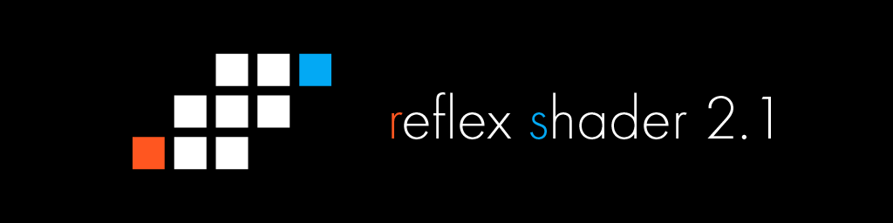

# Reflex Shader 2
This shader is made for VRChat.  
このシェーダーはVRChatにおいて利用されることを前提に開発されています。

## Files / ファイル一覧
- Shaders
  - functions
    - Reflex Shader Function.asset (ASE用のファンクションファイル。シェーダーの本体はここに記述してある。)
  - Reflex Shader 2 Cutout.shader (Transparent Cutoutで切り抜きたいとき用)
  - Reflex Shader 2 Opaque.shader (透過なし)
  - Reflex Shader 2 Transparent.shader (表情等の透過用。バグが多いためマテリアルを分けて使うか使わないことを推奨。)
- Matcap
  - Shadow 01.png (Matcap Shadowで擬似影を付けたい場合用のテクスチャ01)
  - Shadow 01.png (Matcap Shadowで擬似影を付けたい場合用のテクスチャ02)
- LISENCE (MITライセンスの内容が記述されている)
- README.md (このファイル)

## Lisence / ライセンス
当シェーダーはMITライセンスに基づき配布されています。  
MITライセンスに基づき、再配布、商用利用、改変等すべて許可しています。

## Contact / 連絡先
Twitter : @reflex_1124  
VRChat : reflex1124
